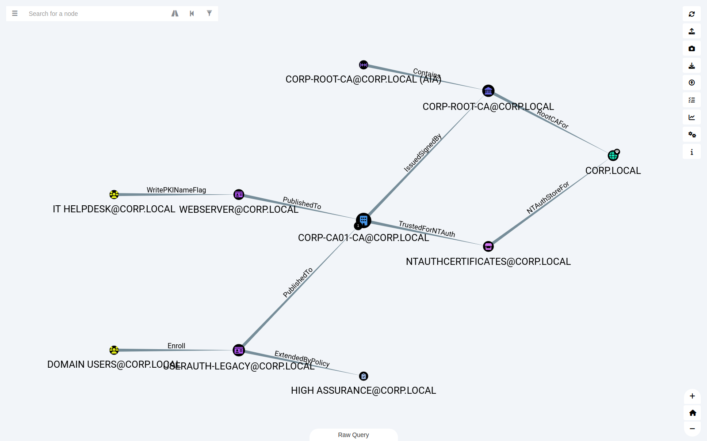
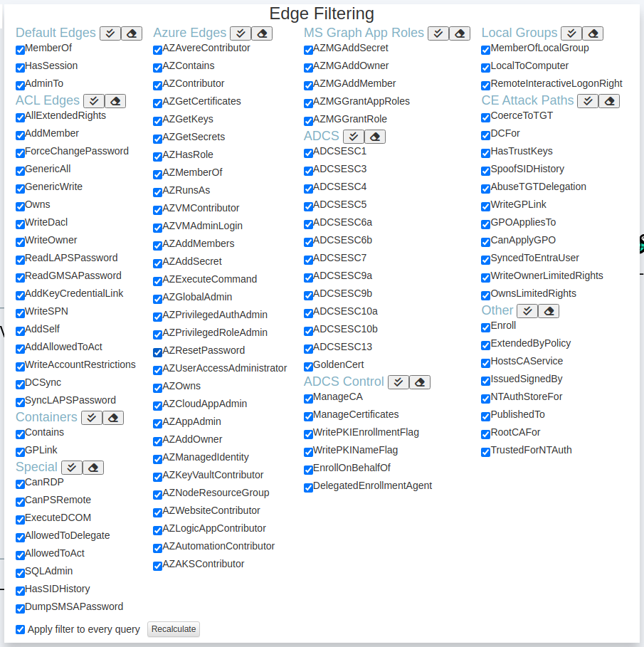
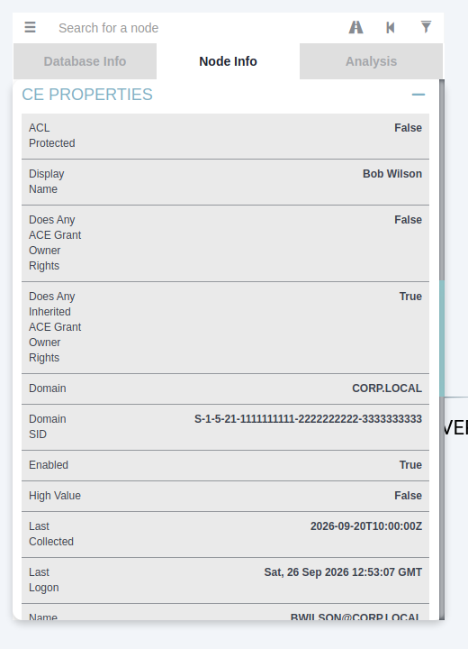
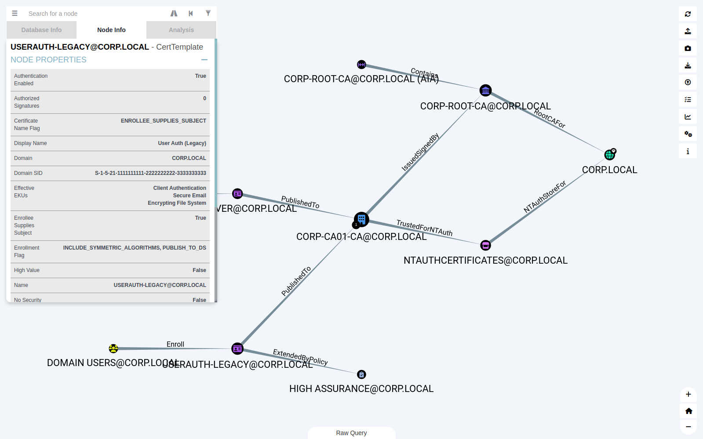
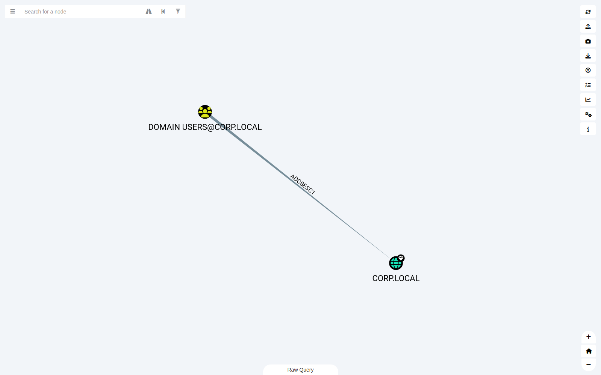
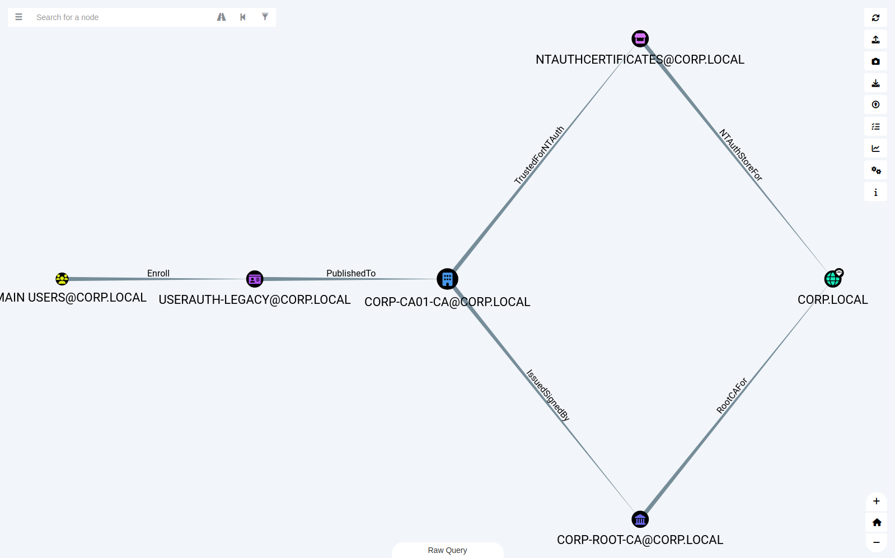
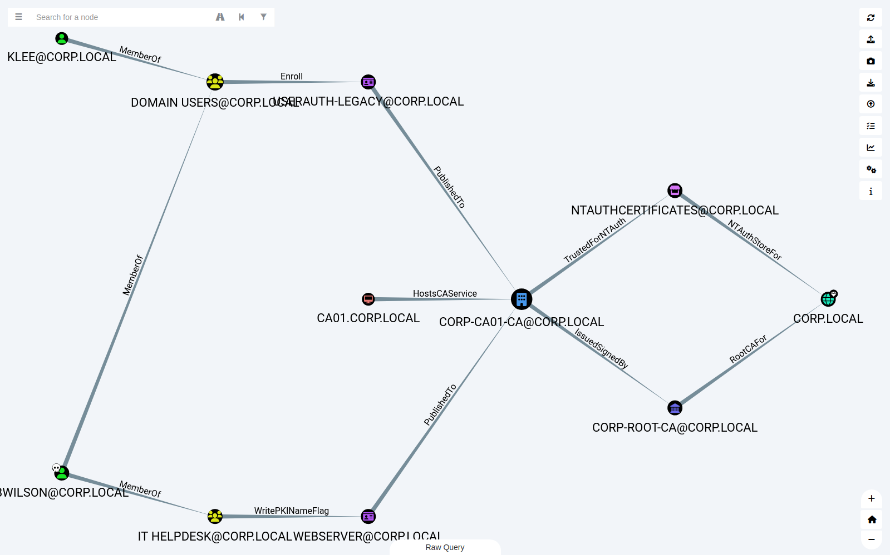
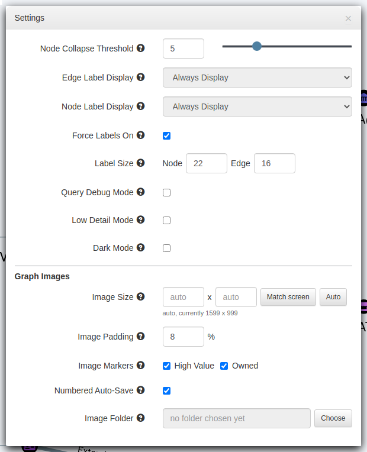
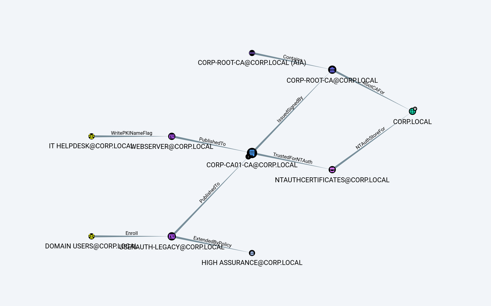
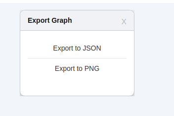

# BloodHound Legacy 4.3.1 with CE support

A fork of [BloodHound Legacy](https://github.com/SpecterOps/BloodHound-Legacy) 4.3.1 that can display and work with data collected for BloodHound Community Edition (CE): ADCS objects, local groups and the newer attack-path edges. It also adds label, image-export and filtering improvements. The stock prebuilt queries are unchanged.

The screenshots below use a small fictional `CORP.LOCAL` domain.

## Why this fork

I run assessments for a living and I'm in BloodHound most of the working week, so this isn't a novelty project. It comes out of a specific, daily friction: BloodHound CE is the tool I collect with and do detailed path analysis in, but it is not the tool I want to *look* at a large environment in, and it is not the tool I want to pull graphics from for a report.

On a real engagement the graphs get dense fast. CE's layout packs everything tightly and the nodes shrink as the graph grows, so on a large domain the picture becomes a wall of tiny icons that is hard to reason about and worse to hand to a reader. BloodHound Legacy lays the same data out far more legibly — it spreads nodes out, keeps them at a readable size, and stays usable when there is a lot on screen. For getting an overall sense of the attack surface, and especially for producing a clean, readable figure to drop into a report, Legacy's output is simply better.

So I use both tools deliberately, for different jobs: CE for collection and for detailed, honed-in work on a single path, and Legacy for the big-picture view and for report-quality graphics. The catch is that Legacy (4.3.1) predates CE's collection, so pointing it at a CE database used to leave a lot out — ADCS objects drew as blank question marks, local groups and the newer attack-path edges had no icons, and much of what CE marks as high value or explains about each edge never showed up. That made Legacy pretty but incomplete against modern data.

This fork closes that gap. It teaches Legacy to read and display CE-collected data, so I keep Legacy's readable layout and cleaner screenshots while still seeing everything CE knows about: the CE node kinds and icons, the high-value markers CE applies, the CE edges and their descriptions, the ADCS attack-path composition, and PKI/AD CS counts in the Database Info tab. If you also run assessments and live in both tools, that's the itch this scratches. Most of the changes are small quality-of-life fixes you'll recognise immediately; the sections below walk through each one.

## CE node icons

Every CE node kind gets CE's own icon and colour, including the ADCS kinds that Legacy drew as blank question marks: EnterpriseCA, RootCA, AIACA, NTAuthStore, CertTemplate and IssuancePolicy. Local groups and users (ADLocalGroup, ADLocalUser) and AZFederatedIdentityCredential are covered too. Low detail mode uses the same colours.



## PKI / AD CS objects in Database Info

The Database Info tab counts on-prem and Azure objects but had no counts for the ADCS objects CE collects. A **PKI / AD CS OBJECTS** section now sits right after **On-Prem Objects**, counting Certificate Templates, Enterprise CAs, Root CAs, AIA CAs, NTAuth Stores and Issuance Policies. On a database with no ADCS data collected the counts are simply zero.

## Edge filtering for every edge and every query

- **New sections** for the CE edges: ADCS (ESC1 to ESC13, GoldenCert), ADCS Control, Local Groups and CE Attack Paths. All are enabled by default.
- **Other** lists any edge type found in a drawn graph that has no row yet, so every edge type can be filtered.
- **Apply filter to every query.** Stock Legacy only applies the filter to the few queries that use the `{}` placeholder. With this on, unchecked edges also drop out of prebuilt, custom and raw queries and the Node Info counts. Queries that write to the database are never changed.
- **Recalculate** reruns the current query with the current filter.

On small windows the list scrolls inside the pane, so the footer stays visible.



## CE Properties in Node Info

BloodHound CE collection enriches objects with extra properties, including ordinary users, computers, groups and domains (for example `system_tags`, `isaclprotected` and `doesanyinheritedacegrantownerrights`). Stock Legacy showed these only as raw keys under Extra Properties, and not at all for some node kinds.

Every Node Info panel now has a **CE Properties** section. It lists all of the node's properties with readable names, shows lists one item per line and formats dates. It starts collapsed and remembers whether you last left it open.



Node kinds that Legacy has no panel for at all (CertTemplate, EnterpriseCA, RootCA, NTAuthStore, IssuancePolicy, ADLocalGroup and so on) used to leave the Node Info tab showing the previous node. They now open to their name and kind with CE Properties expanded:



## ADCS attack-path composition

Like BloodHound Community Edition, an ADCS attack edge can be expanded into the underlying chain it summarises. Right-click an ADCS edge (ESC1, ESC3, ESC4, ESC6a/b, ESC9a/b, ESC10a/b, ESC13 or GoldenCert) and choose **Expand ADCS Composition**.

For example, this single `ADCSESC1` edge from Domain Users to the domain:



expands into the enrollment right, the template's publication to the enterprise CA, the CA's certificate chain up to the domain's root CA, and the CA's NT-auth trust:



Right-click a **domain** and choose **Expand ADCS Attack Paths** to draw every ADCS attack that targets it at once:



These mirror CE's published composition queries. They rely on data collected for CE (the ADCS nodes and edges); with none present they return nothing, as in CE.

## Help text for the CE edges

Right-clicking an edge and choosing **Help** opens a panel describing what the edge is. Stock Legacy has no panel for the CE edges, so they used to open an empty box. Every CE edge now has an **Info** tab explaining what the edge represents and what it lets a principal do, and a **Refs** tab linking to the official BloodHound documentation for the full abuse and detection guidance.

This covers the ADCS attack edges (ESC1, ESC3–ESC7, ESC9a/b, ESC10a/b, ESC13 and GoldenCert), the ADCS control edges (ManageCA, ManageCertificates, WritePKIEnrollmentFlag, WritePKINameFlag, EnrollOnBehalfOf, DelegatedEnrollmentAgent), the local group edges (MemberOfLocalGroup, LocalToComputer, RemoteInteractiveLogonRight) and the newer CE attack-path edges (CoerceToTGT, DCFor, HasTrustKeys, SpoofSIDHistory, AbuseTGTDelegation, WriteGPLink, GPOAppliesTo, CanApplyGPO, SyncedToEntraUser, SyncedToADUser, WriteOwnerLimitedRights, OwnsLimitedRights, WriteOwnerRaw, OwnsRaw). Any CE edge without its own entry (for example a newer edge this build predates) falls back to a generic panel that names the edge and links to the BloodHound documentation, instead of the stock “report this error” message.

## High value markers from CE

CE marks Tier Zero with the `Tag_Tier_Zero` label and `admin_tier_0` in `system_tags` rather than Legacy's `highvalue` property, so a CE database used to show almost no diamonds. A node now gets the high value diamond when any of these is true:

- it has `highvalue: true` (Legacy's own marking, as before)
- it has the `Tag_Tier_Zero` label
- its `system_tags` contain `admin_tier_0`
- it is a protected object, while **Protected Groups Are High Value** is on (see below)

Protected objects are the AD protected groups (Domain Admins, Enterprise Admins, Schema Admins, Administrators, Domain Controllers, Read-only Domain Controllers, Key Admins, Enterprise Key Admins, Enterprise Domain Controllers, Account, Server, Print and Backup Operators, Replicators) and all their nested members, the objects CE's `ProtectAdminGroups` edges point to, Azure tenants, and the groups, users, service principals and devices holding the Global Administrator or Privileged Role Administrator role.

This is display only: nothing is written to the database. The protected set is read with a single query when the graph opens and is refreshed when the setting changes or a node is marked or unmarked from the right-click menu. The **Mark / Unmark as High Value** actions work as before; unmarking a node that CE or the protected set still marks leaves its diamond in place.




**Labels**

- **Force Labels On** (default on) keeps node and edge labels visible at every zoom level and stops the Ctrl/Cmd key from hiding node labels.
- **Label Size** sets node and edge label sizes in pixels (default 22 and 16).

**High Value**

- **Protected Groups Are High Value** (default on) shows the diamond on protected groups and their members, `ProtectAdminGroups` targets, Azure tenants and privileged Entra role holders, as described above.

**Graph Images**

- **Image Size**: a fixed size, or blank for the graph's on-screen size.
- **Image Padding**: zooms out slightly so nothing sits on the edge of the image.
- **Image Markers**: whether saved images show the High Value and Owned markers.
- **Numbered Auto-Save**: saves straight to the image folder as `00001.png`, `00002.png`, ... without asking.
- **Image Folder**: where images are saved.

<br clear="right">

## Saving graph images

The **camera button** in the menu strip saves the graph using the settings above. Right-click it to change the folder. **Export Graph > Export to PNG** uses the same exporter. The image is framed exactly as the graph is on screen:



In light mode the Export Graph popup is now styled as a card:



## Building

Needs Node 16 (upstream pins Electron 11 and webpack 4).

```
npm ci
npm test                 # edge filter tests
npm run build:macos      # or build:win32 / build:linux
```

On Node 17 or later, set `NODE_OPTIONS=--openssl-legacy-provider` so webpack 4 can build.

Settings and custom queries live in the app's user data folder, not in the app, so replacing an existing BloodHound Legacy install keeps them.

---

# BloodHound Legacy Edition (v4) Has Been Deprecated

This repository is for BloodHound Legacy (version 4), which was last updated in 2023 and is no longer maintained. It will be archived in the near future.

## Please Use the New BloodHound Community Edition

BloodHound Legacy has been replaced by the free BloodHound Community Edition:  
* [BloodHound Community Edition GitHub repository](https://github.com/SpecterOps/BloodHound)  
* [Installation instructions](https://bloodhound.specterops.io/get-started/quickstart/community-edition-quickstart)  
* [Full documentation](https://bloodhound.specterops.io)  

BloodHound was created by [@_wald0](https://www.twitter.com/_wald0), [@CptJesus](https://twitter.com/CptJesus), and [@harmj0y](https://twitter.com/harmj0y).

BloodHound is maintained by the [BloodHound Enterprise](https://bloodhoundenterprise.io/) team.

## Access to Deprecated Resources

You can still access the deprecated BloodHound Legacy documentation [here](https://bloodhound.readthedocs.io/en/latest/index.html).

# About BloodHound Enterprise

[BloodHound Enterprise](https://specterops.io/bloodhound-overview/) is an Attack Path Management solution that continuously maps and quantifies Active Directory attack paths. It helps eliminate millions—even billions—of attack paths within your existing architecture, removing the attacker’s easiest, most reliable, and most attractive techniques.

# License

BloodHound uses graph theory to reveal hidden relationships and
attack paths in an Active Directory environment.
Copyright (C) 2016–2025 SpecterOps Inc.

This program is free software: you can redistribute it and/or modify
it under the terms of the GNU General Public License as published by
the Free Software Foundation, either version 3 of the License, or
(at your option) any later version.

This program is distributed in the hope that it will be useful,
but WITHOUT ANY WARRANTY; without even the implied warranty of
MERCHANTABILITY or FITNESS FOR A PARTICULAR PURPOSE.  See the
GNU General Public License for more details.

You should have received a copy of the GNU General Public License
along with this program.  If not, see <http://www.gnu.org/licenses/>.
 